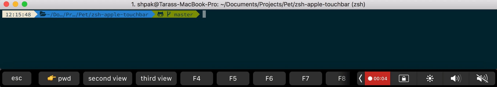

# zsh-apple-touchbar

Make your touchbar more powerful.



## Requirements

* iTerm2 3.1 or later
* zsh
* ruby 2.3.4 or later (only if you want automatic generation)

**In iterm2:** Go to `View -> Customize Tool Bar...` and drag & drop the `Fn` module

## Installation

### Manual

1. Clone this repository somewhere on your machine. This guide will assume `~/.zsh/zsh-apple-touchbar`.

```sh
git clone https://github.com/floor114/zsh-apple-touchbar ~/.zsh/zsh-apple-touchbar
```

2. Add the following to your `.zshrc`:

```sh
source ~/.zsh/zsh-apple-touchbar/zsh-apple-touchbar.zsh
```

3. Start a new terminal session.


### Oh My Zsh

1. Clone this repository into `$ZSH_CUSTOM/plugins` (by default `~/.oh-my-zsh/custom/plugins`)

```sh
git clone https://github.com/floor114/zsh-apple-touchbar $ZSH_CUSTOM/plugins/zsh-apple-touchbar
```

2. Add the plugin to the list of plugins for Oh My Zsh to load:

```sh
plugins=(zsh-apple-touchbar)
```

3. Start a new terminal session.

## Customization

### Automatic

You can define simple commands for FN keys in `config.yml` file. 

#### Structure

File should have two base keys:
1. `default_view` - default view to show.
2. `views` - list of defined views.

`views` section contains views you want to show. **Key is a view name.**

Under view name key you should define next keys:
1. `text` -  text that will show on touchbar key.
2. `command` or `view` - `command` means executing some command that under is this key and `view` means show view that is under this key
3. `back` - under this key should be a view name that will be shown after executing some command.

#### Example

```yml
default_view: first
views:
  first:
    1:
      text: 👉 pwd
      command: pwd |tr -d "\\n" |pbcopy
    2:
      text: second view
      view: second
    3:
      text: third view
      view: third
  second:
    1:
      text: 👈 back
      view: first
    2:
      text: current path
      command: pwd
    back: first
  third:
    1:
      text: 👈 back
      view: first
    2:
      text: ls
      command: ls -la
```

For generating view from `config.yml` file go to its folder:

```sh
cd $ZSH_CUSTOM/plugins/zsh-apple-touchbar
```

and run `generate.rb` file:

```sh
ruby generate.rb
```

### Custom
If you need more complicated logic you can rewrite `zsh-apple-touchbar.zsh` file on your own.

#### View functions
For each `view` you need to define separate function that will contain keys creation. E.G.

```bash
function first_view() {
  remove_and_unbind_keys

  set_state 'first'

  create_key 1 '👉 pwd' 'pwd |tr -d "\\n" |pbcopy' '-s'
  create_key 2 'second view' 'second_view'
}

function second_view() {
  remove_and_unbind_keys

  set_state 'second'

  create_key 1 '👈 back' 'first_view'
  create_key 2 'current path' 'pwd' '-s'

  set_state 'first'
}
```

In every function first, you need to remove and unbind old keys with `remove_and_unbind_keys` function.

Then you need to set a state (`state` variable define which view to show after reinitialization) with `set_state` function.

After that, you can create keys for this view with `create_key` function.

And after keys part you can set new state (if you want to show some view after executing key command).

#### Keys creation
Keys creates with `create_key` function

This function accept 4 arguments:
1. number of key (from 1 to 12)
2. key text
3. `command` or `view`
4. bind option (`-s` if third argument isn't a view, nothing if it is)

#### Init widgets
For calling views in main function you need to init widgets for every view function.

```bash
zle -N first
zle -N second
```

#### Main function
Here you need to define which view to show for every state.

```bash
precmd_apple_touchbar() {
  case $state in
    first) first_view ;;
    second) second_view ;;
  esac
}
```

#### Full example
```bash
source ${0:A:h}/functions.zsh

set_state 'first'

function first_view() {
  remove_and_unbind_keys

  set_state 'first'

  create_key 1 '👉 pwd' 'pwd |tr -d "\\n" |pbcopy' '-s'
  create_key 2 'second view' 'second_view'
}

function second_view() {
  remove_and_unbind_keys

  set_state 'second'

  create_key 1 '👈 back' 'first_view'
  create_key 2 'current path' 'pwd' '-s'

  set_state 'first'
}

zle -N first_view
zle -N second_view

precmd_apple_touchbar() {
  case $state in
    first) first_view ;;
    second) second_view ;;
  esac
}

autoload -Uz add-zsh-hook

add-zsh-hook precmd precmd_apple_touchbar
```

## Contributing

If you have some proposals how to improve this boilerplate feel free to open issues and send pull requests!

1. Fork it
2. Create your feature branch (git checkout -b my-new-feature)
3. Commit your changes (git commit -am 'Add some feature')
4. Push to the branch (git push origin my-new-feature)
5. Create new Pull Request

## License

Available as open source under the terms of the [MIT License](https://opensource.org/licenses/MIT).
